### Hi there, I'm Muzaffer Kadir YILMAZ 👋

Software developer with 5+ years of experience who has worked on the back-end and front-end of various websites, from successful startups to e-commerce, messaging, and news services. Proven skills in problem-solving, analytical thinking, and creativity across diverse projects. Deeply engaged with Artificial Intelligence, specialized in Prompt Engineering, integrating LLMs into automated workflows, and developing AI-powered platforms like chatbot solutions. Experienced in JavaScript technologies such as Node.js (Express), Vue, Next.js and React. Also has a solid foundation in MongoDB, Docker, and DevOps.

## 🌐 Socials:
   

Personal Website: [mkdir.dev](https://mkdir.dev) or [muzafferkadir.com](https://www.muzafferkadir.com/)

## 💻 Tech Stack:

<table>
  <tr>
    <td valign="middle">
      Languages:
    </td>
    <td valign="middle">
      
      
      
    </td>
  </tr>
  <tr>
    <td valign="middle">
      Frameworks:
    </td>
    <td valign="middle">
      
      
      
      
      
    </td>
  </tr>
  <tr>
    <td valign="middle">
      Frontend:
    </td>
    <td valign="middle">
      
      
      
      
      
    </td>
  </tr>
  <tr>
    <td valign="middle">
      Backend:
    </td>
    <td valign="middle">
      
      
      
      
      
      
    </td>
  </tr>
  <tr>
    <td valign="middle">
      Databases:
    </td>
    <td valign="middle">
      
      
    </td>
  </tr>
  <tr>
    <td valign="middle">
      Tools:
    </td>
    <td valign="middle">
      
      
      
      
      
      
      
      
      
    </td>
  </tr>
  <tr>
    <td valign="middle">
      Platforms:
    </td>
    <td valign="middle">
      
      
      
      
      
      
    </td>
  </tr>
  <tr>
    <td valign="middle">
      Other:
    </td>
    <td valign="middle">
      
      
    </td>
  </tr>
</table>

 

  
  

<!--
**muzafferkadir/muzafferkadir** is a ✨ _special_ ✨ repository because its `README.md` (this file) appears on your GitHub profile.

Here are some ideas to get you started:

- 🔭 I’m currently working on ...
- 🌱 I’m currently learning ...
- 👯 I’m looking to collaborate on ...
- 🤔 I’m looking for help with ...
- 💬 Ask me about ...
- 📫 How to reach me: ...
- 😄 Pronouns: ...
- ⚡ Fun fact: ...
-->
